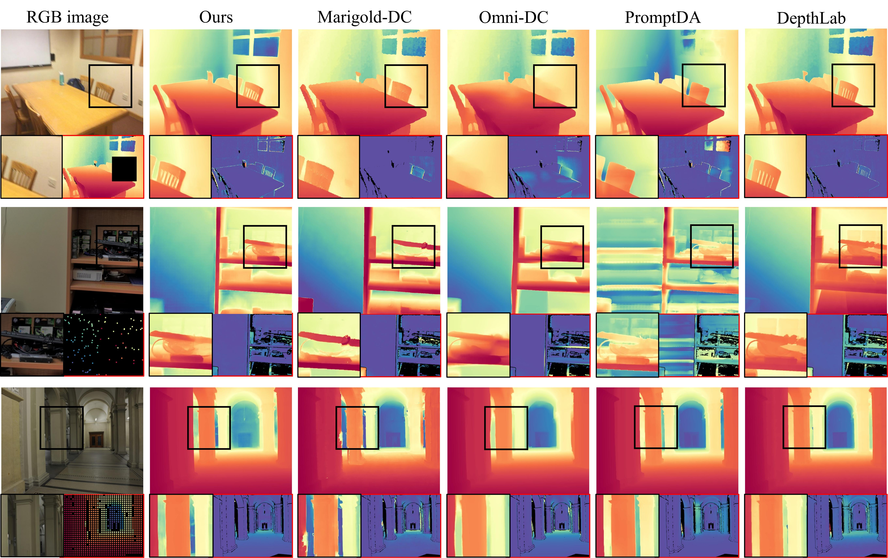

<div align="center">
<h1>Depth Anything with Any Prior</h1>

[**Zehan Wang**](https://zehanwang01.github.io/)<sup>1*</sup> · [**Siyu Chen**]()<sup>1*</sup> · [**Lihe Yang**](https://liheyoung.github.io/)<sup>2</sup>
<br>
[**Jialei Wang**]()<sup>1</sup> · [**Ziang Zhang**](https://scholar.google.com/citations?user=DptGMnYAAAAJ&hl=en&oi=ao)<sup>1</sup> · [**Hengshuang Zhao**](https://hszhao.github.io/)<sup>2</sup> · [**Zhou Zhao**](https://mypage.zju.edu.cn/zhaozhou)<sup>1</sup>

<sup>1</sup>ZJU&emsp;&emsp;&emsp;<sup>2</sup>HKU
<br>
<div class="is-size-6 publication-authors">
  <span class="author-block">* Equal Contribution</span></a>&nbsp</a>&nbsp</a>&nbsp</a>&nbsp</a>&nbsp</a>&nbsp</a>&nbsp
</div>
<br>

<a href="https://arxiv.org/abs/2505.10565"></a>
<a href='https://prior-depth-anything.github.io/'></a>
</div>

This work presents Prior Depth Anything, a framework that combines incomplete but precise metric information in depth measurement with relative but complete geometric structures in depth prediction, generating accurate, dense, and detailed metric depth maps for any scene



## News
- **2025-05-21:** We provide one more way to input your own geometric prior. (To minimize code changes, we use "geometric" to represent the geometric prior.)
- **2025-05-15:** We released [Paper](https://arxiv.org/pdf/2505.10565), [Project Page](https://prior-depth-anything.github.io/), [Code](https://github.com/SpatialVision/Prior-Depth-Anything) and [Models](https://huggingface.co/Rain729/Prior-Depth-Anything)

## Pretrained Models

We provide two model [**checkpoints**](https://huggingface.co/Rain729/Prior-Depth-Anything) of varying scales for robust metric depth completion. The checkpoints will be downloaded when you first run our demo.

## Usage1: Demo

### Prepraration

First, clone this repository and create environment with `python=3.9`.
```bash
git clone https://github.com/SpatialVision/Prior-Depth-Anything
cd Prior-Depth-Anything
conda create -n priorda python=3.9
conda activate priorda
```
Then, install the dependencies with the following command. If you encounter the issue that the installed `torch_cluster` is not for CUDA, please install `torch_cluster==1.6.3 -f https://pytorch-geometric.com/whl/torch-2.2.2+cu121.html` instead to download the gpu version (refer to [this issue](https://github.com/SpatialVision/Prior-Depth-Anything/issues/2)).
```bash
pip install -r requirements.txt
```
or you can install `Prior-Depth-Anything` as a package.
```bash
pip install -e .
```

### Quick start:
To run with CLI, you can just begin by following command (Installing `Prior-Depth-Anything` as a package is required.). On the initial execution, the [model weights](#Pretrained-Models) will be automatically downloaded from the Hugging Face Model Hub.
```bash
# We sample on Ground-Truth depth map as prior.
priorda test --image_path assets/sample-1/rgb.jpg --prior_path assets/sample-1/gt_depth.png --pattern downscale_32 --visualize 1 
```

Alternatively, you can use our model with:

```python
import torch
from prior_depth_anything import PriorDepthAnything

device = "cuda:0" if torch.cuda.is_available() else "cpu"
priorda = PriorDepthAnything(device=device)
image_path = 'assets/sample-2/rgb.jpg'
prior_path = 'assets/sample-2/prior_depth.png'

output = priorda.infer_one_sample(image=image_path, prior=prior_path, visualize=True)
```
The results will be saved at `./output`. 

<details> <summary> More example </summary>

```python
import torch
from prior_depth_anything import PriorDepthAnything

device = "cuda:0" if torch.cuda.is_available() else "cpu"
priorda = PriorDepthAnything(device=device)
image_path = 'assets/sample-6/rgb.npy'
prior_path = 'assets/sample-6/prior_depth.npy'

output = priorda.infer_one_sample(image=image_path, prior=prior_path, visualize=True)
```
</details>  

### Coarse-only estimation.
To facilitate further research, we offer an interface to the first-stage 'coarse alignment' process. You can generate the coarse-aligned depth map by simply configuring the `coarse_only` option. For example:
```python
priorda = PriorDepthAnything(device=device, coarse_only=True)
```
### Geometric Depth
We provide two ways that allow you utilize geometric information from other depth estimation models.  
1. Replace the depth estimation model in the coarse stage [here](./prior_depth_anything/depth_completion.py#L165).
2. Just input the geometric depth to `infer_one_sample()` by specify `geometric` (refer to [Inference Configurations](#inference-configurations)). With CLI, you should add the item `--geometric_path assets/sample-1/geo_depth.npy`. 

### More options:

#### &ensp;&ensp;Model Configurations
- `fmde_dir`: Directory of the coarse-stage coarse alignment model backbone.
- `cmde_dir`: Directory of the fine-stage fine alignment model backbone.
- `ckpt_dir`: Directory of the fine-stage model fintuned by us.
- `frozen_model_size`: Specify the size of the coarse-stage model(choices=['vits', 'vitb', 'vitl']).
- `conditioned_model_size`: Specify the size of the fine-stage model(choices=['vits', 'vitb', 'vitl'(coming soon...)]).

#### &ensp;&ensp;Inference Configurations
- `image`: Path to the input image.
- `prior`: Path to the prior.
- `geometric`: Path to the geometric depth estimated by depth estimation models.
- `pattern`: Pattern to sample in the prior.
- `double_global(bool)`: Whether to use double globally-aligned conditions.
- `visualize(bool)`: Whether to visualize the results.

## Usage2: Plugin

`Prior-Depth-Anything` showcases remarkable zero-shot robustness in the presence of varied and potentially noisy prior inputs. It is engineered to function as a plug-and-play module for other depth estimation frameworks, boosting their performance. Integrating this module requires only a few lines of code, leading to improved depth estimation accuracy.
### Prepraration

Set up the environment as in [prepraration](#prepraration).

### Quick start:

Here, we use `VGGT` as an example.

First, use the `VGGT` model to predict the depth map. The code below is from [VGGT official website](https://github.com/facebookresearch/vggt).
```python
import torch
from vggt.models.vggt import VGGT
from vggt.utils.load_fn import load_and_preprocess_images

device = "cuda" if torch.cuda.is_available() else "cpu"
# bfloat16 is supported on Ampere GPUs (Compute Capability 8.0+) 
dtype = torch.bfloat16 if torch.cuda.get_device_capability()[0] >= 8 else torch.float16

# Initialize the model and load the pretrained weights.
# This will automatically download the model weights the first time it's run, which may take a while.
model = VGGT.from_pretrained("facebook/VGGT-1B").to(device)

# Load and preprocess example images (replace with your own image paths)
image_names = ['assets/sample-2/rgb.jpg'] 
images = load_and_preprocess_images(image_names).to(device)

with torch.no_grad():
    with torch.cuda.amp.autocast(dtype=dtype):
        # Predict attributes including cameras, depth maps, and point maps.
        predictions = model(images)
```
Then use `Prior-Depth-Anything` to refine the depth map.

```python
# Initialize prior-depth-anything module.
from PIL import Image
import numpy as np
import torch.nn.functional as F
from prior_depth_anything.plugin import PriorDARefiner, PriorDARefinerMetrics

Refiner = PriorDARefiner(device=device)

# Reload RGB for refiner.
priorda_image = torch.from_numpy(np.asarray(Image.open(image_names[0])).astype(np.uint8))

### Refine depth 
depth_map, depth_conf = predictions['depth'], predictions['depth_conf']
refined_depth, meview_depth_map = Refiner.predict(
    image=priorda_image, depth_map=depth_map.squeeze(), confidence=depth_conf.squeeze())
# The size of `refined_depth` is the same as `priorda_mage`, tune it to your need.
```
We provide a whole example [here](./enhance_depth.py) including the performance comparison between the original depth map and the refined depth map. For quantitive evaluation results, please refer to our paper.

## Acknowledgement

We would like to express our sincere gratitude to the following excellent works:

- [Zoedepth](https://github.com/isl-org/ZoeDepth)
- [Depth-Anything-V2](https://github.com/DepthAnything/Depth-Anything-V2)
- [OMNI-DC](https://github.com/princeton-vl/OMNI-DC)
- [PromptDA](https://github.com/DepthAnything/PromptDA)
- [Depth Pro](https://github.com/apple/ml-depth-pro)
- [VGGT](https://github.com/facebookresearch/vggt)

## Citation

If you find this project useful, please consider citing:

```bibtex
@misc{wang2025depthprior,
      title={Depth Anything with Any Prior}, 
      author={Zehan Wang and Siyu Chen and Lihe Yang and Jialei Wang and Ziang Zhang and Hengshuang Zhao and Zhou Zhao},
      year={2025},
      eprint={2505.10565},
      archivePrefix={arXiv},
      primaryClass={cs.CV},
      url={https://arxiv.org/abs/2505.10565}, 
}
```
